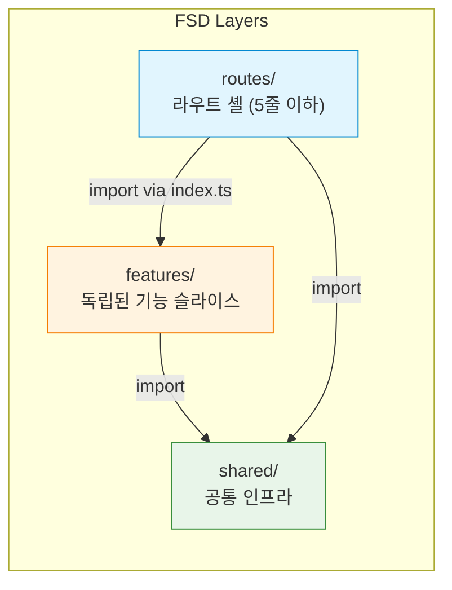
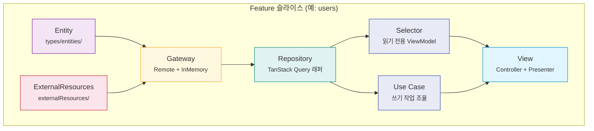
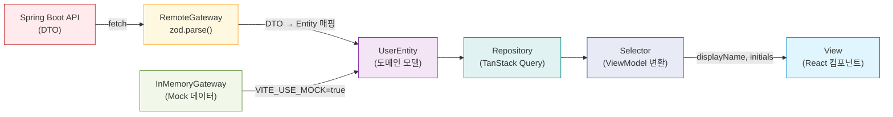
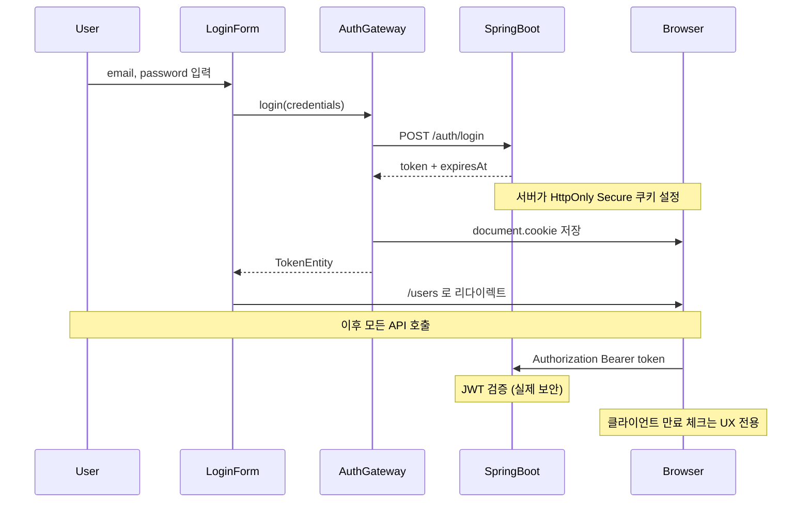
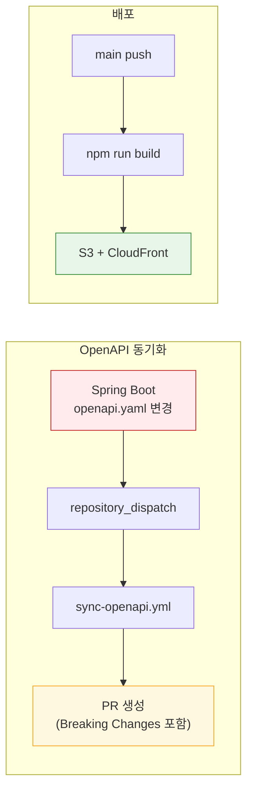
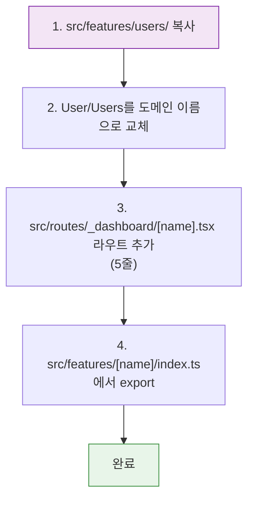
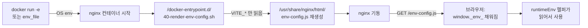
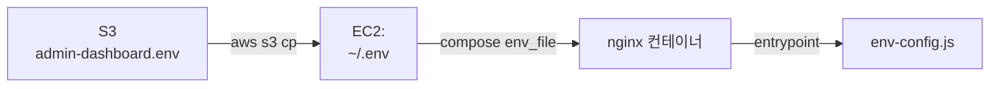

# Admin Dashboard Template

관리자 대시보드 템플릿. **TanStack Router + Feature-Sliced Design + Clean Architecture + OpenAPI** 타입 안전성을 결합한 프론트엔드 아키텍처 레퍼런스.

## 기술 스택

| 영역 | 기술 | 비고 |
|---|---|---|
| 프레임워크 | Vite + React 19 | SPA, SSR 없음 |
| 라우팅 | TanStack Router | 파일 기반 라우팅 |
| 서버 상태 | TanStack Query | Repository 계층에서 래핑 |
| 유효성 검증 | Zod | Gateway 경계에서만 사용 |
| API 타입 | openapi-typescript | 타입만 생성, 클라이언트 코드 생성 없음 |
| HTTP | native fetch | axios 사용하지 않음 |
| 테스트 | Vitest + Testing Library | TDD (Red-Green-Refactor) |
| 아키텍처 경계 | eslint-plugin-boundaries + dependency-cruiser | FSD 계층 규칙 강제 |

## 아키텍처

### FSD + Clean Architecture 하이브리드

**Feature-Sliced Design (FSD)** 으로 프로젝트를 조직하고, 각 Feature 슬라이스 내부에 **Clean Architecture** 유닛을 배치합니다.



**FSD 규칙:**
- `shared/` → `features/` → `routes/` 순서로만 의존 (역방향 금지)
- Feature 간 교차 import 금지 (`users/` ↛ `auth/`)
- `routes/` 파일은 `createFileRoute` + 컴포넌트 import만 포함

### Feature 내부 Clean Architecture

각 Feature 슬라이스는 동일한 Clean Architecture 유닛 구조를 따릅니다:



### 데이터 흐름



### Clean Architecture 유닛 설명

| 유닛 | 위치 | 역할 |
|---|---|---|
| **Entity** | `types/entities/` | 도메인 모델 + Zod 스키마. API DTO와 무관 |
| **ExternalResources** | `externalResources/` | HTTP 클라이언트 인스턴스 + API 호출 함수. 생성된 타입의 유일한 진입점 |
| **Gateway** | `repositories/XxxGateway/` | DTO ↔ Entity 매핑. Remote(실제 API)와 InMemory(Mock) 두 구현체 |
| **Repository** | `repositories/` | TanStack Query `useQuery`/`useMutation` 래퍼 |
| **Selector** | `selectors/` | 읽기 전용 훅. Entity → ViewModel 변환 (부수효과 없음) |
| **Use Case** | `useCases/` | 쓰기 작업 조율. 하나의 Use Case = 하나의 Mutation |
| **Controller** | `views/.../useController` | 사용자 액션 핸들러 (Use Case 위임) |
| **Presenter** | `views/.../usePresenter` | 렌더링용 데이터 준비 (Selector 위임) |

### 인증 흐름



## 프로젝트 구조

```
admin-dashboard-template/
├── openapi.yaml                    # API 스키마 (Spring Boot와 동기화)
├── .env.example                    # 환경변수 템플릿
├── .github/workflows/
│   ├── sync-openapi.yml            # OpenAPI 스펙 자동 동기화 + PR 생성
│   └── deploy.yml                  # main push → S3 + CloudFront 배포
│
├── src/
│   ├── shared/                     # 공통 인프라
│   │   ├── api/
│   │   │   ├── generated/          # openapi-typescript 출력 (수동 편집 금지)
│   │   │   │   └── api.d.ts
│   │   │   ├── httpClient.ts       # native fetch 래퍼
│   │   │   └── errorHandler.ts     # ApiError 클래스
│   │   └── lib/
│   │       ├── auth.ts             # JWT 만료 체크, 리다이렉트
│   │       └── queryClient.ts      # QueryClient 싱글턴
│   │
│   ├── features/
│   │   ├── users/                  # 사용자 관리 (CRUD)
│   │   │   ├── types/entities/     # UserEntity + Zod 스키마
│   │   │   ├── externalResources/  # UsersApi + httpClient 인스턴스
│   │   │   ├── repositories/       # Gateway (Remote/InMemory) + Repository
│   │   │   ├── selectors/          # useUsersSelector, useUserByIdSelector
│   │   │   ├── useCases/           # Create, Update, Delete
│   │   │   ├── views/containers/   # Users (목록) + UserForm (생성/수정)
│   │   │   └── index.ts            # Public API: { Users, UserForm }
│   │   │
│   │   └── auth/                   # 인증 (로그인)
│   │       ├── types/entities/     # TokenEntity + Zod 스키마
│   │       ├── externalResources/  # AuthApi
│   │       ├── repositories/       # RemoteAuthGateway + Repository
│   │       ├── useCases/           # useLoginUseCase
│   │       ├── views/containers/   # LoginForm
│   │       └── index.ts            # Public API: { LoginForm }
│   │
│   └── routes/                     # TanStack Router (셸 파일, 5줄 이하)
│       ├── __root.tsx              # QueryClientProvider + Devtools
│       ├── _dashboard.tsx          # 대시보드 레이아웃
│       ├── _dashboard/users.tsx    # → Users 컴포넌트
│       └── login.tsx               # → LoginForm 컴포넌트
│
├── eslint.config.ts                # FSD 경계 규칙
├── dependency-cruiser.config.cjs   # 의존성 경계 검증
└── vitest.config.ts                # 테스트 설정
```

## 시작하기

```bash
git clone <repo-url>
cd admin-dashboard-template
npm install
cp .env.example .env.local
npm run generate:api
```

### 개발 서버 실행

```bash
# Mock 모드 (백엔드 없이 실행, InMemory 데이터 사용)
VITE_USE_MOCK=true npm run dev

# 실제 백엔드 연결
npm run dev
```

### 사용 가능한 스크립트

| 스크립트 | 설명 |
|---|---|
| `npm run dev` | 개발 서버 시작 |
| `npm run build` | 프로덕션 빌드 → `/dist` |
| `npm run test` | Vitest 테스트 실행 |
| `npm run generate:api` | OpenAPI 스키마 → 타입 재생성 (출처는 `OPENAPI_SOURCE` 환경변수) |
| `npm run dep-graph` | 의존성 그래프 SVG 생성 |

### 환경변수

런타임 (브라우저로 노출됨, `VITE_` 접두):

| 변수 | 설명 | 기본값 |
|---|---|---|
| `VITE_API_BASE_URL` | 백엔드(FastAPI) API 주소 — CORS `allow_origins`에 등록된 origin이어야 함 | `https://staging-api.pardocs.com` |
| `VITE_USE_MOCK` | `true`이면 InMemoryGateway 사용 | - |

빌드 시점 (브라우저로 노출되지 않음):

| 변수 | 설명 | 기본값 |
|---|---|---|
| `OPENAPI_SOURCE` | `npm run generate:api`가 읽을 OpenAPI 스키마 위치. URL 또는 로컬 경로 모두 허용 | `https://staging-api.pardocs.com/openapi.json` |

`OPENAPI_SOURCE` 시나리오 (배포된 백엔드의 `/openapi.json`을 쓰는 게 가장 단순):

| 상황 | 값 |
|---|---|
| 평상시 개발 (배포된 staging 사용) | `https://staging-api.pardocs.com/openapi.json` |
| Production 스펙 기준으로 타입 고정 | `https://api.pardocs.com/openapi.json` |
| 로컬에서 백엔드를 띄움 | `http://localhost:8000/openapi.json` |
| 오프라인·부트스트랩 폴백 | `./openapi.json` (정적 파일) |

진실의 원천은 백엔드다. 이 템플릿은 출처를 강제하지 않고 환경변수로 추상화한다. FastAPI는 기본적으로 `/openapi.json`을 노출하므로 Swagger UI(`/docs`)가 보이는 호스트라면 schema도 같은 호스트에서 받을 수 있다.

## Mock 모드

`VITE_USE_MOCK=true`로 실행하면 모든 Feature가 `InMemoryGateway`를 사용합니다.

- 네트워크 호출 없음 — 모든 데이터가 메모리에 저장
- 3명의 시드 사용자로 초기화 (Alice, Bob, Carol)
- CRUD 작업이 즉시 반영
- 인증 체크 생략 (백엔드 불필요)

## 배포

### S3 + CloudFront

```bash
npm run build
aws s3 sync ./dist s3://$S3_BUCKET --delete
aws cloudfront create-invalidation --distribution-id $CF_ID --paths "/*"
```

### CI/CD 파이프라인



**필요한 GitHub Secrets:**

| Secret | 설명 |
|---|---|
| `AWS_ACCESS_KEY_ID` | AWS IAM Access Key |
| `AWS_SECRET_ACCESS_KEY` | AWS IAM Secret Key |
| `AWS_REGION` | AWS 리전 (예: `ap-northeast-2`) |
| `S3_BUCKET` | S3 버킷 이름 |
| `CF_DISTRIBUTION_ID` | CloudFront 배포 ID |

## AI 에이전트 사용 가이드

이 템플릿은 AI 기반 개발에 최적화되어 있습니다. 각 Feature 슬라이스가 완전히 자체 완결적이므로, 에이전트는 해당 Feature 디렉토리만 읽으면 됩니다.

### 작업별 컨텍스트

| 작업 | 읽어야 할 경로 |
|---|---|
| 기능 수정 | `src/features/[name]/` 전체 |
| 새 기능 추가 | `src/features/users/`를 템플릿으로 복사 |
| API 타입 갱신 | `generate:api` 실행 후 `XxxApi.types.ts`만 수정 |
| 라우트 추가 | `src/routes/_dashboard/[name].tsx` (5줄) |
| API 호출 디버깅 | `externalResources/`만 확인 |
| 비즈니스 로직 디버깅 | `useCases/` + `selectors/`만 확인 |
| UI 디버깅 | `views/containers/`만 확인 |

**절대 읽지 말 것:** `src/shared/api/generated/` (자동 생성, 노이즈)

### 새 Feature 추가 방법



## 아키텍처 결정 사항

| 결정 | 이유 |
|---|---|
| axios 대신 native fetch | 의존성 최소화, 번들 크기 절감 |
| Gateway에서만 zod 검증 | API 경계에서 한 번만 검증, 내부 계층은 타입 신뢰 |
| InMemoryGateway 필수 | 백엔드 없이 프론트엔드 독립 개발 가능 |
| DTO가 externalResources 밖으로 나가지 않음 | 도메인 모델(Entity)만 상위 계층으로 전달 |
| Query Key 중앙 관리 | `*RepositoryKeys.ts`에서 관리, 캐시 무효화 일관성 보장 |
| Controller/Presenter 패턴 | 읽기(Presenter)와 쓰기(Controller) 관심사 분리 |

## 참고 레포지토리

| 레포지토리 | 참고 내용 |
|---|---|
| [harunou/frontend-clean-architecture-react-tanstack-react-query](https://github.com/harunou/frontend-clean-architecture-react-tanstack-react-query) | Gateway, Repository, Selector, UseCase, Controller/Presenter 패턴 원본 |
| [Feature-Sliced Design](https://feature-sliced.design/) | FSD 아키텍처 공식 문서 |
| [TanStack Router](https://tanstack.com/router/latest) | 파일 기반 라우팅, SPA 설정 |
| [TanStack Query](https://tanstack.com/query/latest) | 서버 상태 관리, 캐시 무효화 패턴 |
| [openapi-typescript](https://openapi-ts.dev/) | OpenAPI → TypeScript 타입 생성 |

## 배포 (Docker + ECR + EC2)

이 템플릿은 nginx 컨테이너로 정적 파일을 서빙하고, ECR에 푸시한 뒤 EC2에서 `docker compose pull && up`으로 갱신하는 흐름을 사용한다.

### 런타임 환경변수 주입

#### 왜 런타임 주입인가

Vite는 `import.meta.env.VITE_*`를 **빌드 시점에 문자열로 인라인**한다. 즉 `npm run build` 결과물(`dist/`)에는 그 시점의 값이 박혀있다. 만약 이 방식만 쓴다면 staging/prod 마다 이미지를 새로 빌드해야 하고, "한 번 만든 이미지를 여러 환경에 배포한다"는 12-Factor 원칙에 어긋난다.

이 템플릿은 **이미지에는 값을 넣지 않고**, 컨테이너가 시작될 때마다 환경값을 주입하도록 구성되어 있다.

#### 주입 흐름



핵심 포인트:
- **이미지에는 값이 박혀있지 않다.** `Dockerfile`은 `npm run build`만 수행하고 빌드 ARG로 `VITE_*`를 받지 않는다. `dist/`에는 `<script src="/env-config.js"></script>` 태그만 있고, 그 파일은 컨테이너 시작 시 동적으로 생성된다.
- **앱 코드는 `import.meta.env.VITE_*`를 직접 읽지 않는다.** 대신 `runtimeEnv` 헬퍼를 통해 `window._env_` → `import.meta.env`(개발 모드 fallback) → 하드코딩된 기본값 순으로 조회한다.
- **`VITE_` 접두가 없는 환경변수는 절대 노출되지 않는다.** entrypoint의 `awk` 필터가 `^VITE_`만 매칭한다.

#### 관련 파일

| 파일 | 역할 |
|---|---|
| `index.html` | `<script src="/env-config.js"></script>`를 메인 번들 이전에 로드 |
| `public/env-config.js` | 개발 모드용 placeholder (`window._env_ = window._env_ \|\| {}`). 컨테이너에서는 entrypoint가 이 파일을 덮어씀 |
| `docker/entrypoint.sh` | nginx 시작 직전 `/usr/share/nginx/html/env-config.js`를 동적 생성. nginx 공식 이미지의 `/docker-entrypoint.d/` 자동 실행 메커니즘 사용 |
| `src/shared/lib/runtimeEnv.ts` | `window._env_` → `import.meta.env` → 기본값 폴백 헬퍼 |
| `src/vite-env.d.ts` | `Window._env_` 타입 선언 |

#### 주입 방법 (3가지 컨텍스트)

**1) `docker run`에 직접 전달**

```sh
docker run --rm -p 8080:80 \
  -e VITE_API_BASE_URL=https://api.staging.example.com \
  -e VITE_USE_MOCK=false \
  admin-dashboard-template:local
```

**2) `docker compose` + `.env` 파일 (로컬 테스트)**

```sh
cat > .env <<EOF
VITE_API_BASE_URL=https://api.staging.example.com
VITE_USE_MOCK=false
EOF

IMAGE=admin-dashboard-template:local docker compose up
```

`docker-compose.yml`에 `env_file: .env`로 선언되어 있어 자동으로 컨테이너에 주입된다.

**3) EC2 (운영 흐름)**



`scripts/deploy-admin-dashboard.sh`가 SSM에서 호출되면 다음을 수행한다:
1. `aws s3 cp s3://...admin-dashboard.env /home/ec2-user/admin-dashboard/.env`
2. `docker compose pull && up -d` — compose가 그 `.env`를 컨테이너 환경으로 주입
3. 컨테이너 안에서 entrypoint가 `env-config.js`를 새로 렌더링

**중요:** 환경값을 바꾸려면 **이미지를 다시 굽지 않는다.** S3의 env 파일만 갱신하고 `deploy-admin-dashboard.sh`만 다시 트리거하면(또는 SSM으로 같은 명령 재실행) 새 값이 반영된다.

#### 새 환경변수 추가 절차

1. 이름은 반드시 `VITE_` 접두로 시작 (그렇지 않으면 entrypoint가 노출하지 않음).
2. `src/vite-env.d.ts`의 `ImportMetaEnv`와 `Window._env_` 타입에 추가.
3. `src/shared/lib/runtimeEnv.ts`의 `RuntimeEnvKey` 유니언과 `runtimeEnv` 객체에 추가 (기본값 포함).
4. 앱 코드에서는 `runtimeEnv.<KEY>`로 사용. `import.meta.env.VITE_*`를 직접 읽지 말 것.
5. `.env.example`에 변수 설명 추가.
6. S3의 환경별 env 파일에 값 추가 (또는 GitHub PR과 함께 인프라 작업 의뢰).

#### 검증 방법

컨테이너 외부에서 즉시 확인:
```sh
curl -s http://<host>/env-config.js
# 출력 예:
# window._env_ = {
#   "VITE_API_BASE_URL": "https://api.staging.example.com",
#   "VITE_USE_MOCK": "false",
# };
```

브라우저 DevTools Console:
```js
window._env_
// → { VITE_API_BASE_URL: "...", VITE_USE_MOCK: "..." }
```

값이 비어있다면:
- `docker exec <container> env | grep VITE_`로 컨테이너 내부 env가 실제로 설정되었는지 확인
- `docker logs <container>` 초기 출력에서 entrypoint 단계 오류 확인
- compose의 `env_file` 경로가 실제 파일을 가리키는지 확인 (상대경로 주의)

#### 보안 메모

- `VITE_*` 변수는 **클라이언트(브라우저)에 그대로 노출**된다. DB 비밀번호·내부 API 키 같은 시크릿을 절대 넣지 말 것 — 빌드타임 인라인 방식과 동일한 위협 모델이다.
- 시크릿이 필요한 호출은 백엔드(API 게이트웨이)를 경유해야 한다.
- entrypoint는 `^VITE_` 매칭만 하므로 의도치 않은 컨테이너 env(`AWS_*`, `HOME`, `PATH` 등)는 자동으로 차단된다.

### 로컬 빌드/실행

```sh
docker build -t admin-dashboard-template:local .

docker run --rm -p 8080:80 \
  -e VITE_API_BASE_URL=https://api.example.com \
  -e VITE_USE_MOCK=false \
  admin-dashboard-template:local

# 검증
curl -s http://localhost:8080/env-config.js          # 주입된 값 확인
curl -sI http://localhost:8080/healthz               # 200 OK
curl -sI http://localhost:8080/users/123             # 200 (SPA fallback)
```

또는 compose:
```sh
echo "VITE_API_BASE_URL=https://api.example.com" > .env
echo "VITE_USE_MOCK=false" >> .env
IMAGE=admin-dashboard-template:local docker compose up
```

### CI 워크플로 (.github/workflows/deploy.yml)

| 트리거 | 동작 | 태그 |
|---|---|---|
| `push: main` | 빌드 → ECR push → SSM이 staging EC2에서 `deploy-admin-dashboard.sh staging` 실행 | `staging` |
| `push: tags v*` | 빌드 → ECR push → SSM이 prod EC2에서 `deploy-admin-dashboard.sh prod` 실행 | `prod`, `v1.x.y` |
| `pull_request: main` | 빌드 검증만 (push/deploy 안 함) | — |

필요한 GitHub Secrets:
- `AWS_ACCESS_KEY_ID`, `AWS_SECRET_ACCESS_KEY` — ECR push + SSM send-command 권한
- `STAGING_INSTANCE_ID`, `PROD_INSTANCE_ID` — EC2 인스턴스 ID

이미지 플랫폼은 `linux/arm64` (Graviton EC2 가정).

### EC2 1회 셋업

각 환경의 EC2 인스턴스에서:

1. Docker + compose 플러그인 설치
2. EC2 IAM 인스턴스 프로파일에 `AmazonEC2ContainerRegistryReadOnly` + S3 환경파일 read 권한 부여
3. SSM Agent가 활성화되어 있고 IAM에 `AmazonSSMManagedInstanceCore` 부여
4. 디렉토리 배치:
   ```
   /home/ec2-user/
   ├── deploy-admin-dashboard.sh         # scripts/deploy-admin-dashboard.sh 복사
   └── admin-dashboard/
       └── docker-compose.yml            # 리포의 docker-compose.yml 복사
   ```
5. `deploy-admin-dashboard.sh` 안의 `<ACCOUNT_ID>`와 S3 env 경로를 실제 값으로 수정
6. S3에 환경별 env 파일 업로드 (예: `s3://pardocs/admin-dashboard.env`):
   ```
   VITE_API_BASE_URL=https://api.production.example.com
   VITE_USE_MOCK=false
   ```

이후 main 브랜치 머지 또는 `v*` 태그 push가 자동 배포를 트리거한다.

## 라이선스

MIT
