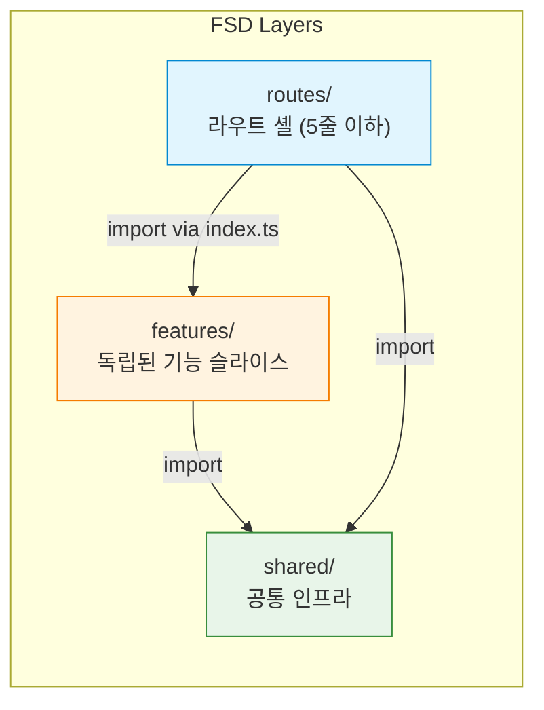
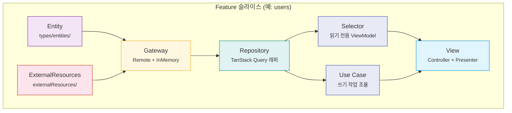
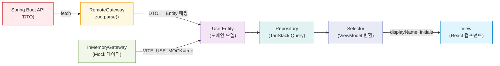
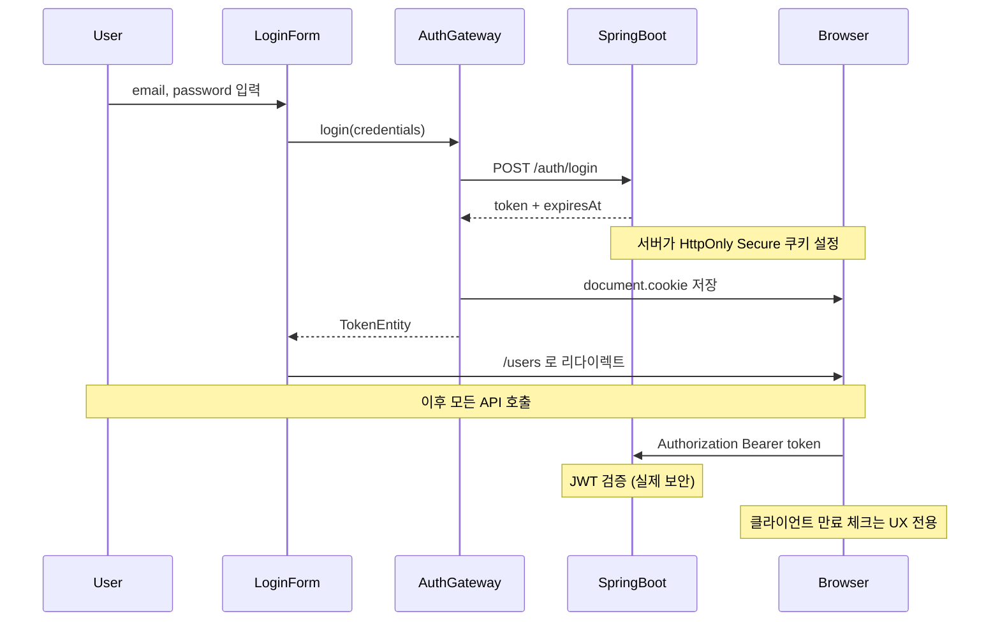
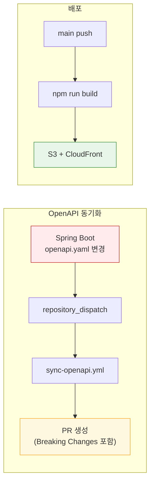
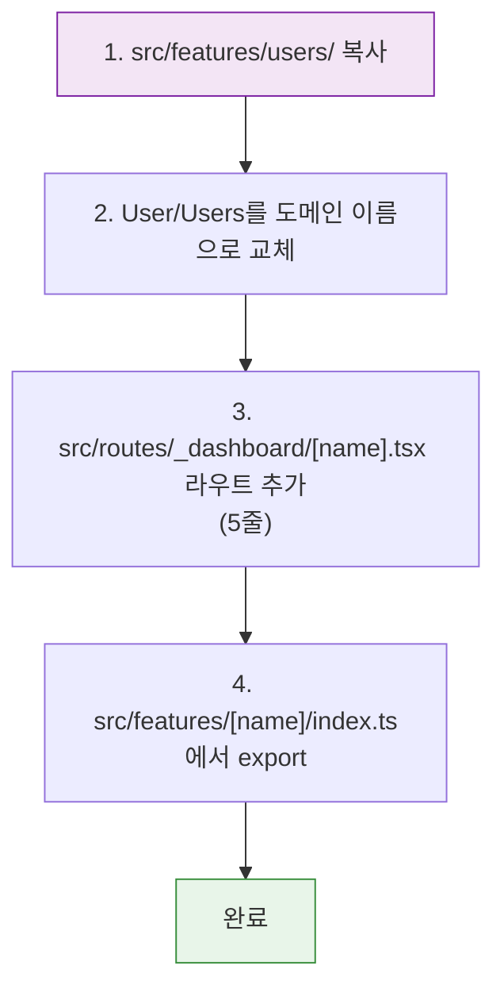

# Admin Dashboard Template

관리자 대시보드 템플릿. **TanStack Router + Feature-Sliced Design + Clean Architecture + OpenAPI** 타입 안전성을 결합한 프론트엔드 아키텍처 레퍼런스.

## 기술 스택

| 영역 | 기술 | 비고 |
|---|---|---|
| 프레임워크 | Vite + React 19 | SPA, SSR 없음 |
| 라우팅 | TanStack Router | 파일 기반 라우팅 |
| 서버 상태 | TanStack Query | Repository 계층에서 래핑 |
| 유효성 검증 | Zod | Gateway 경계에서만 사용 |
| API 타입 | openapi-typescript | 타입만 생성, 클라이언트 코드 생성 없음 |
| HTTP | native fetch | axios 사용하지 않음 |
| 테스트 | Vitest + Testing Library | TDD (Red-Green-Refactor) |
| 아키텍처 경계 | eslint-plugin-boundaries + dependency-cruiser | FSD 계층 규칙 강제 |

## 아키텍처

### FSD + Clean Architecture 하이브리드

**Feature-Sliced Design (FSD)** 으로 프로젝트를 조직하고, 각 Feature 슬라이스 내부에 **Clean Architecture** 유닛을 배치합니다.



**FSD 규칙:**
- `shared/` → `features/` → `routes/` 순서로만 의존 (역방향 금지)
- Feature 간 교차 import 금지 (`users/` ↛ `auth/`)
- `routes/` 파일은 `createFileRoute` + 컴포넌트 import만 포함

### Feature 내부 Clean Architecture

각 Feature 슬라이스는 동일한 Clean Architecture 유닛 구조를 따릅니다:



### 데이터 흐름



### Clean Architecture 유닛 설명

| 유닛 | 위치 | 역할 |
|---|---|---|
| **Entity** | `types/entities/` | 도메인 모델 + Zod 스키마. API DTO와 무관 |
| **ExternalResources** | `externalResources/` | HTTP 클라이언트 인스턴스 + API 호출 함수. 생성된 타입의 유일한 진입점 |
| **Gateway** | `repositories/XxxGateway/` | DTO ↔ Entity 매핑. Remote(실제 API)와 InMemory(Mock) 두 구현체 |
| **Repository** | `repositories/` | TanStack Query `useQuery`/`useMutation` 래퍼 |
| **Selector** | `selectors/` | 읽기 전용 훅. Entity → ViewModel 변환 (부수효과 없음) |
| **Use Case** | `useCases/` | 쓰기 작업 조율. 하나의 Use Case = 하나의 Mutation |
| **Controller** | `views/.../useController` | 사용자 액션 핸들러 (Use Case 위임) |
| **Presenter** | `views/.../usePresenter` | 렌더링용 데이터 준비 (Selector 위임) |

### 인증 흐름



## 프로젝트 구조

```
admin-dashboard-template/
├── openapi.yaml                    # API 스키마 (Spring Boot와 동기화)
├── .env.example                    # 환경변수 템플릿
├── .github/workflows/
│   ├── sync-openapi.yml            # OpenAPI 스펙 자동 동기화 + PR 생성
│   └── deploy.yml                  # main push → S3 + CloudFront 배포
│
├── src/
│   ├── shared/                     # 공통 인프라
│   │   ├── api/
│   │   │   ├── generated/          # openapi-typescript 출력 (수동 편집 금지)
│   │   │   │   └── api.d.ts
│   │   │   ├── httpClient.ts       # native fetch 래퍼
│   │   │   └── errorHandler.ts     # ApiError 클래스
│   │   └── lib/
│   │       ├── auth.ts             # JWT 만료 체크, 리다이렉트
│   │       └── queryClient.ts      # QueryClient 싱글턴
│   │
│   ├── features/
│   │   ├── users/                  # 사용자 관리 (CRUD)
│   │   │   ├── types/entities/     # UserEntity + Zod 스키마
│   │   │   ├── externalResources/  # UsersApi + httpClient 인스턴스
│   │   │   ├── repositories/       # Gateway (Remote/InMemory) + Repository
│   │   │   ├── selectors/          # useUsersSelector, useUserByIdSelector
│   │   │   ├── useCases/           # Create, Update, Delete
│   │   │   ├── views/containers/   # Users (목록) + UserForm (생성/수정)
│   │   │   └── index.ts            # Public API: { Users, UserForm }
│   │   │
│   │   └── auth/                   # 인증 (로그인)
│   │       ├── types/entities/     # TokenEntity + Zod 스키마
│   │       ├── externalResources/  # AuthApi
│   │       ├── repositories/       # RemoteAuthGateway + Repository
│   │       ├── useCases/           # useLoginUseCase
│   │       ├── views/containers/   # LoginForm
│   │       └── index.ts            # Public API: { LoginForm }
│   │
│   └── routes/                     # TanStack Router (셸 파일, 5줄 이하)
│       ├── __root.tsx              # QueryClientProvider + Devtools
│       ├── _dashboard.tsx          # 대시보드 레이아웃
│       ├── _dashboard/users.tsx    # → Users 컴포넌트
│       └── login.tsx               # → LoginForm 컴포넌트
│
├── eslint.config.ts                # FSD 경계 규칙
├── dependency-cruiser.config.cjs   # 의존성 경계 검증
└── vitest.config.ts                # 테스트 설정
```

## 시작하기

```bash
git clone <repo-url>
cd admin-dashboard-template
npm install
cp .env.example .env.local
npm run generate:api
```

### 개발 서버 실행

```bash
# Mock 모드 (백엔드 없이 실행, InMemory 데이터 사용)
VITE_USE_MOCK=true npm run dev

# 실제 백엔드 연결
npm run dev
```

### 사용 가능한 스크립트

| 스크립트 | 설명 |
|---|---|
| `npm run dev` | 개발 서버 시작 |
| `npm run build` | 프로덕션 빌드 → `/dist` |
| `npm run test` | Vitest 테스트 실행 |
| `npm run generate:api` | `openapi.yaml` → API 타입 재생성 |
| `npm run dep-graph` | 의존성 그래프 SVG 생성 |

### 환경변수

| 변수 | 설명 | 기본값 |
|---|---|---|
| `VITE_API_BASE_URL` | Spring Boot API 주소 | `http://localhost:8080` |
| `VITE_USE_MOCK` | `true`이면 InMemoryGateway 사용 | - |

## Mock 모드

`VITE_USE_MOCK=true`로 실행하면 모든 Feature가 `InMemoryGateway`를 사용합니다.

- 네트워크 호출 없음 — 모든 데이터가 메모리에 저장
- 3명의 시드 사용자로 초기화 (Alice, Bob, Carol)
- CRUD 작업이 즉시 반영
- 인증 체크 생략 (백엔드 불필요)

## 배포

### S3 + CloudFront

```bash
npm run build
aws s3 sync ./dist s3://$S3_BUCKET --delete
aws cloudfront create-invalidation --distribution-id $CF_ID --paths "/*"
```

### CI/CD 파이프라인



**필요한 GitHub Secrets:**

| Secret | 설명 |
|---|---|
| `AWS_ACCESS_KEY_ID` | AWS IAM Access Key |
| `AWS_SECRET_ACCESS_KEY` | AWS IAM Secret Key |
| `AWS_REGION` | AWS 리전 (예: `ap-northeast-2`) |
| `S3_BUCKET` | S3 버킷 이름 |
| `CF_DISTRIBUTION_ID` | CloudFront 배포 ID |

## AI 에이전트 사용 가이드

이 템플릿은 AI 기반 개발에 최적화되어 있습니다. 각 Feature 슬라이스가 완전히 자체 완결적이므로, 에이전트는 해당 Feature 디렉토리만 읽으면 됩니다.

### 작업별 컨텍스트

| 작업 | 읽어야 할 경로 |
|---|---|
| 기능 수정 | `src/features/[name]/` 전체 |
| 새 기능 추가 | `src/features/users/`를 템플릿으로 복사 |
| API 타입 갱신 | `generate:api` 실행 후 `XxxApi.types.ts`만 수정 |
| 라우트 추가 | `src/routes/_dashboard/[name].tsx` (5줄) |
| API 호출 디버깅 | `externalResources/`만 확인 |
| 비즈니스 로직 디버깅 | `useCases/` + `selectors/`만 확인 |
| UI 디버깅 | `views/containers/`만 확인 |

**절대 읽지 말 것:** `src/shared/api/generated/` (자동 생성, 노이즈)

### 새 Feature 추가 방법



## 아키텍처 결정 사항

| 결정 | 이유 |
|---|---|
| axios 대신 native fetch | 의존성 최소화, 번들 크기 절감 |
| Gateway에서만 zod 검증 | API 경계에서 한 번만 검증, 내부 계층은 타입 신뢰 |
| InMemoryGateway 필수 | 백엔드 없이 프론트엔드 독립 개발 가능 |
| DTO가 externalResources 밖으로 나가지 않음 | 도메인 모델(Entity)만 상위 계층으로 전달 |
| Query Key 중앙 관리 | `*RepositoryKeys.ts`에서 관리, 캐시 무효화 일관성 보장 |
| Controller/Presenter 패턴 | 읽기(Presenter)와 쓰기(Controller) 관심사 분리 |

## 참고 레포지토리

| 레포지토리 | 참고 내용 |
|---|---|
| [harunou/frontend-clean-architecture-react-tanstack-react-query](https://github.com/harunou/frontend-clean-architecture-react-tanstack-react-query) | Gateway, Repository, Selector, UseCase, Controller/Presenter 패턴 원본 |
| [Feature-Sliced Design](https://feature-sliced.design/) | FSD 아키텍처 공식 문서 |
| [TanStack Router](https://tanstack.com/router/latest) | 파일 기반 라우팅, SPA 설정 |
| [TanStack Query](https://tanstack.com/query/latest) | 서버 상태 관리, 캐시 무효화 패턴 |
| [openapi-typescript](https://openapi-ts.dev/) | OpenAPI → TypeScript 타입 생성 |

## 라이선스

MIT
