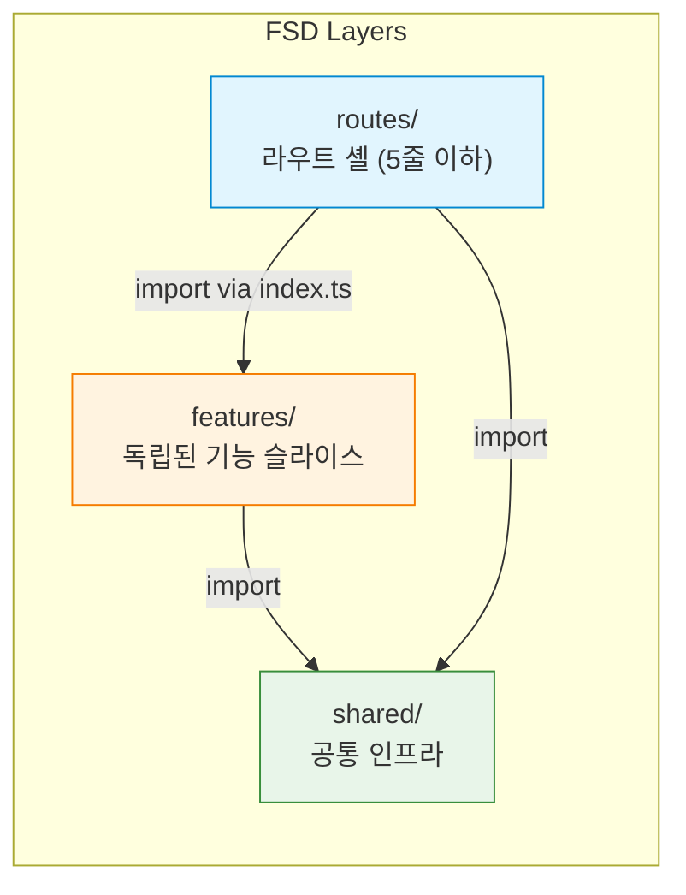
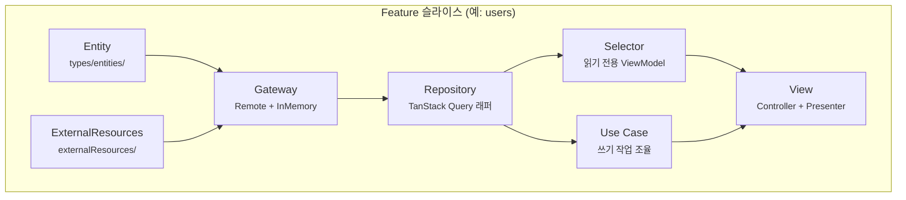
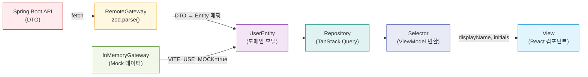
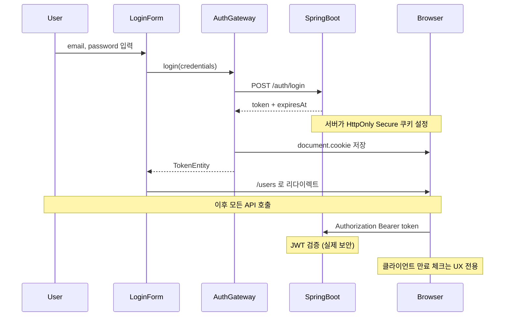
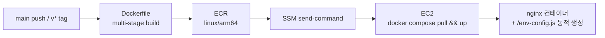

# Admin Dashboard Template — 채택 가이드

> 관리자 대시보드 React 템플릿 — **TanStack + Feature-Sliced Design + Clean Architecture + OpenAPI 타입 안전성**

- **리포**: https://github.com/oulico/admin-dashboard-template
- **마지막 검토**: 2026-04-29
- **이 문서의 목적**: 새 프로젝트에 이 템플릿을 도입할지 검토할 때 참고할 수 있도록 의사결정의 배경·대안·트레이드오프를 정리. README는 *어떻게 쓰는가*를 다루고, 이 문서는 *왜 이렇게 만들었는가*를 다룬다.

---

## 1. TL;DR

OpenAPI 스펙이 있는 백엔드(예: Spring Boot)와 짝을 이루는 **어드민·내부도구 SPA**를 빠르게 시작하기 위한 템플릿이다. 프레임워크는 Vite + React 19, 라우팅은 TanStack Router, 서버 상태는 TanStack Query를 Repository 계층으로 래핑한다. 코드는 Feature-Sliced Design으로 분할하고 각 슬라이스 내부는 Clean Architecture(Gateway → Repository → Selector/UseCase → Controller/Presenter) 유닛으로 구성한다. **타입은 OpenAPI에서 생성하고, 데이터 검증은 Gateway 경계에서만 Zod로 한 번** 수행한다. 백엔드 없이도 즉시 개발 가능한 InMemoryGateway를 1급 시민으로 둔다. 배포는 Docker 이미지로 빌드해 ECR에 올리고 EC2에서 nginx로 서빙하며, **이미지를 환경별로 다시 빌드하지 않도록 `window._env_` 패턴으로 런타임 env 주입**한다.

얻는 것: 계층 분리, 타입 안전성, 백엔드 독립 개발, 환경별 단일 이미지 재사용. 얻을 수 없는 것: SSR/SEO, 1~2 화면짜리 마이크로 도구의 가벼움, 비-OpenAPI 백엔드 즉시 호환성.

---

## 2. 한눈에 보기

### 기술 스택

| 영역 | 기술 | 비고 |
|---|---|---|
| 프레임워크 | Vite + React 19 | SPA, SSR 없음 |
| 라우팅 | TanStack Router | 파일 기반 라우팅, 타입 안전 |
| 서버 상태 | TanStack Query | Repository 계층에서 래핑 |
| 유효성 검증 | Zod | Gateway 경계에서만 사용 |
| API 타입 | openapi-typescript | 타입만 생성, 클라이언트 코드 생성 없음 |
| HTTP | native fetch | axios 사용하지 않음 |
| 테스트 | Vitest + Testing Library | TDD (Red-Green-Refactor) |
| 아키텍처 경계 | eslint-plugin-boundaries + dependency-cruiser | FSD 계층 규칙 강제 (이중) |
| 배포 | Docker + nginx + ECR + EC2(SSM) | 런타임 env 주입(`window._env_`) |

### 계층 구조 (FSD)



### Feature 내부 (Clean Architecture)



---

## 3. 사용 시나리오

### 3.1 잘 맞는 경우

- **OpenAPI 스펙이 있는 백엔드와 페어링**되는 어드민·운영도구·내부 SaaS
- 도메인 슬라이스가 점진적으로 늘어날 가능성 (`users`, `orders`, `billing`, …)
- TDD/타입 안전성/계층 분리에 가치를 두는 팀 (코드 리뷰 비용 대비 규칙 강제 자동화 선호)
- 백엔드 개발과 **병렬**로 프론트를 진행해야 하는 환경 (Mock 데이터로 즉시 시작)
- 다환경 배포 시 동일 이미지 재사용이 중요한 운영 모델

### 3.2 맞지 않는 경우 ("쓰면 안 되는가" 솔직판)

| 상황 | 더 적합한 선택 |
|---|---|
| SSR/SEO가 핵심인 공개 사이트, 마케팅 페이지 | Next.js / Remix |
| 1~2 화면짜리 마이크로 도구 | Vite + 간단한 폴더 구조 (계층 오버헤드 과함) |
| 결제·고보안 폼 중심 (PCI-DSS 등) | BFF/서버 검증 우선 패턴, SPA 비중 축소 |
| 비-OpenAPI 백엔드 (GraphQL, gRPC, 사내 RPC) | 타입 파이프라인 재설계 (codegen 도구가 다름) |
| 페이지 단위 단순 CRUD가 1~2개 | 직접 fetch + 컴포넌트 1~2개로 충분 |
| React를 처음 도입하는 팀이 학습 곡선을 빠르게 가져가야 할 때 | 표준 React + React Query만으로 시작 후 점진 도입 |

이 템플릿은 *작은 비용을 미리 지불해 큰 비용을 뒤로 미루는* 구조다. 프로젝트가 그만큼 자랄 가능성이 없다면 비용만 남는다.

---

## 4. 아키텍처 결정 사항 (ADR)

각 ADR 포맷: **Decision / Context / Alternatives / Rationale / Consequences / References**.

### ADR-01. 프레임워크: Vite + React 19 (SPA)

- **Decision**: Vite + React 19 SPA. Next.js·Remix 같은 메타 프레임워크는 사용하지 않는다.
- **Context**: 어드민·내부도구는 인증 게이트 뒤에 있어 SEO가 무의미하고, 첫 페인트 시간보다 *개발 속도*와 *번들 단순성*이 가치 있다.
- **Alternatives**:
  - *Next.js* — SSR/RSC 도입 시 계층 책임이 서버/클라이언트로 갈라져 본 템플릿의 Gateway/Repository 분리와 충돌. 서버 컴포넌트에서 TanStack Query를 쓰는 방식은 이중 캐시 모델을 야기.
  - *Remix* — 데이터 로더 패턴이 이미 Repository 역할을 부분적으로 점유. 라우트별 loader가 본 템플릿의 Repository 훅과 책임 중복.
- **Rationale**: SSR이 필요 없는 운영 도구에서는 SPA가 단순하고 디버깅 비용이 낮다. Vite의 HMR이 빠르고 설정이 적다.
- **Consequences**:
  - (+) 빌드/실행 환경이 정적 자산 + nginx로 단순.
  - (+) 모든 데이터 패칭이 클라이언트에 일원화되어 계층 책임이 명확.
  - (−) SEO/공유 미리보기·고-LCP 요구가 생기면 재구성 필요.
- **References**: `vite.config.ts`, `index.html`, `src/main.tsx`

### ADR-02. 라우팅: TanStack Router

- **Decision**: TanStack Router(파일 기반). React Router는 사용하지 않는다.
- **Context**: 라우트 파라미터·검색 파라미터·loader 데이터의 타입이 컴포넌트까지 흘러야 한다. 라우트가 늘어나도 `routes/` 디렉토리의 구조만 보면 사이트맵을 즉시 파악 가능해야 한다.
- **Alternatives**:
  - *React Router v6/v7* — 타입은 추가 가공 필요, 파일 기반 라우팅은 외부 도구(generouted 등) 의존.
- **Rationale**: 파일 = 라우트라는 1:1 매핑이 라우트 셸을 5줄 미만으로 유지하기에 좋다. `createFileRoute`가 타입 안전한 params/search를 자동 추론.
- **Consequences**:
  - (+) `routes/`만 보면 전체 사이트맵 한눈에.
  - (+) 컨테이너 컴포넌트와 라우트 정의 분리 — 라우트 파일은 import + `createFileRoute` 호출만.
  - (−) 생태계가 React Router보다 작음. 일부 서드파티 가이드는 React Router 가정.
- **References**: `src/routes/`, `src/main.tsx`, `vite.config.ts`(`@tanstack/router-plugin/vite`)

### ADR-03. 서버 상태: TanStack Query를 Repository 계층에서 래핑

- **Decision**: `useQuery`/`useSuspenseQuery`/`useMutation`을 컴포넌트에서 직접 호출하지 않는다. Feature 내부의 `repositories/` 모듈이 `useXxxQuery`/`useXxxMutation` 훅을 노출한다.
- **Context**: 같은 데이터를 여러 컴포넌트에서 쓰는 일이 흔하고, 캐시 키·invalidate 규칙이 분산되면 일관성이 깨진다.
- **Alternatives**:
  - *컴포넌트에서 직접 호출* — 캐시 키 중복·invalidate 누락이 빈번.
  - *Redux Toolkit Query* — 별도 store 도입, 본 템플릿의 다른 계층과 모델 중복.
- **Rationale**: Repository가 (a) Gateway 호출, (b) 쿼리 키, (c) invalidate 규칙을 한 곳에 묶으면 컴포넌트는 "데이터가 필요해" 수준의 호출만 한다.
- **Consequences**:
  - (+) 캐시 무효화 누락이 컴파일 타임/리뷰에서 잡힘.
  - (+) `useSuspenseQuery` + AsyncBoundary 조합으로 로딩/에러 UX 표준화 가능.
  - (−) "이 한 줄을 위해 Repository가 필요한가" 같은 회의가 작은 페이지에서 발생.
- **References**: `src/features/users/repositories/usersRepository/usersRepository.ts`, `src/features/users/repositories/usersRepository/usersRepositoryKeys.ts`

### ADR-04. HTTP: native fetch (axios 미사용)

- **Decision**: 얇은 fetch 래퍼(`createHttpClient`)를 만들고 axios는 도입하지 않는다.
- **Context**: 모던 브라우저는 fetch + AbortController로 axios의 핵심 기능 대부분을 커버한다.
- **Alternatives**:
  - *axios* — `transformResponse`·인터셉터 등 강력하지만 의존성 + 번들 사이즈, *모든 호출이 axios 인스턴스에 의존*하는 결합 유발.
  - *ky / wretch* — 추가 의존성. 본 템플릿의 사용 범위는 fetch로도 충분.
- **Rationale**: 의존성 최소화, 번들 사이즈 절감, "프레임워크 위의 프레임워크" 회피.
- **Consequences**:
  - (+) 의존성 트리 단순.
  - (+) 어댑터 교체(MSW 등) 시 결합점이 명확.
  - (−) 인터셉터가 필요한 경우 직접 구현 — refresh-on-401, 동시 401 mutex, 토큰 첨부, 만료 체크 등을 래퍼 안에 직접 둔다(ADR-14 참조).
- **References**: `src/shared/api/httpClient.ts`, `src/shared/api/errorHandler.ts`

### ADR-05. API 타입: openapi-typescript (타입만 생성)

- **Decision**: OpenAPI에서 **타입만** 생성한다. fetch 함수·React Query 훅 같은 클라이언트 코드는 생성하지 않는다.
- **Context**: 백엔드 스펙이 진실의 원천이되, 프론트 호출 코드는 사람의 통제 하에 둔다.
- **Alternatives**:
  - *orval* — 훅까지 생성. 본 템플릿의 Gateway 패턴과 책임 중복.
  - *openapi-generator* — 클라이언트 클래스 생성, axios 가정.
- **Rationale**: ExternalResources/Gateway가 명시적으로 타입을 매핑·검증한다. 자동 생성된 호출 코드는 본 템플릿의 계층 책임을 침범한다.
- **Consequences**:
  - (+) DTO 타입은 백엔드와 동기화, 호출 형태는 자유.
  - (+) `src/shared/api/generated/`는 기계 생성물로 격리(수동 편집 금지) 가능.
  - (−) 호출 보일러플레이트는 직접 작성 (그래서 ExternalResources/Gateway 슬라이스가 존재).
- **References**: `src/shared/api/generated/`, `package.json`(`generate:api`), `openapi.yaml`

### ADR-06. 코드 조직: FSD + Clean Architecture 하이브리드

- **Decision**: 최상위는 Feature-Sliced Design(`shared`/`features`/`routes`)으로 나누고, **각 Feature 내부**에 Clean Architecture 유닛(Entity/ExternalResources/Gateway/Repository/Selector/UseCase/View)을 둔다.
- **Context**: FSD는 "독립 슬라이스가 옆 슬라이스를 모른다"는 강한 격리는 주지만 슬라이스 내부 구조에는 의견이 적다. Clean Architecture는 슬라이스 내부 구조에 답을 주지만 도메인 간 경계에는 의견이 약하다.
- **Alternatives**:
  - *순수 FSD* — 슬라이스 내부 구조가 팀마다 갈림.
  - *순수 Clean Architecture (단일 도메인)* — 도메인이 늘면 폴더가 폭발.
- **Rationale**: 두 패턴의 장점을 조합. 슬라이스 사이는 FSD로, 슬라이스 안은 CA로.
- **Consequences**:
  - (+) 새 Feature는 `users/`를 그대로 복제 → 도메인명만 치환하면 시작.
  - (+) AI/주니어가 "어디에 코드를 둬야 하나"를 헤매지 않음.
  - (−) 작은 Feature(폼 1개짜리)에는 유닛이 비어 있는 빈 폴더가 생길 수 있음.
- **References**: `src/features/users/`, `src/features/auth/`, `src/shared/`

### ADR-07. 경계 강제: eslint-plugin-boundaries + dependency-cruiser (이중)

- **Decision**: FSD/CA 경계 위반을 두 도구로 동시에 잡는다.
- **Context**: 한 도구만 쓰면 우회 패턴이 생긴다. 코드 리뷰에 의존하면 시간이 갈수록 침식된다.
- **Alternatives**:
  - *코드 리뷰만* — 사람이 잊는다.
  - *eslint만* — IDE 단계에선 즉시 알지만 동적 경로/순환 의존 같은 그래프 차원의 규칙은 약함.
  - *dependency-cruiser만* — CI에서만 잡히고 IDE 피드백 부재.
- **Rationale**: eslint-plugin-boundaries는 *작성 중*(IDE) 즉시 경고, dependency-cruiser는 *빌드 단계*에서 그래프 규칙(circular, dev→prod, generated 격리, 테스트 분리)을 강제. 둘이 다른 시점·다른 입자에서 동작하므로 중복이 아니다.
- **Consequences**:
  - (+) 침식 저항성↑, 새 기여자가 규칙을 자연 학습.
  - (+) `npm run dep-graph`로 의존 그래프 시각화 가능.
  - (−) 규칙 추가 시 두 곳을 모두 수정해야 함.
- **References**: `eslint.config.ts`, `dependency-cruiser.config.cjs`

### ADR-08. 데이터 검증: Gateway 경계에서만 Zod

- **Decision**: 외부에서 들어오는 데이터(API 응답)는 Gateway에서 `zod.parse()`로 한 번 검증하고, 그 안쪽 계층은 타입을 신뢰한다.
- **Context**: 모든 계층에서 검증하면 비용이 누적되고, 검증이 없으면 잘못된 DTO가 도메인 안쪽까지 새어 들어간다.
- **Alternatives**:
  - *모든 계층에서 검증* — 비용·중복.
  - *검증 없음* — 백엔드 변경이 런타임 에러로 늦게 발현.
- **Rationale**: "신뢰 경계는 입구 한 곳"이라는 보안·DDD 원칙을 그대로 적용.
- **Consequences**:
  - (+) Entity 타입은 항상 검증된 도메인 모델.
  - (+) 백엔드 스키마 변경이 Gateway에서 즉시 폭발 — 빠른 실패.
  - (−) Gateway 코드량이 늘고 Entity vs DTO를 별도로 정의해야 함.
- **References**: `src/features/users/repositories/usersRepository/UsersGateway/`, `src/features/users/types/entities/`

### ADR-09. 데이터 모델: DTO ↔ Entity 매핑, DTO는 ExternalResources 밖으로 나가지 않는다

- **Decision**: API DTO 타입은 ExternalResources/Gateway 안에서만 보이고, 상위 계층(Repository, Selector, View)에는 항상 도메인 Entity가 흐른다.
- **Context**: DTO를 그대로 컴포넌트까지 흘리면 백엔드 필드명/구조 변경이 UI까지 파급된다.
- **Alternatives**:
  - *DTO 그대로 사용* — 매핑 코드 없음, 그러나 결합도↑.
  - *ViewModel을 Selector에서 또 만든다* — 본 템플릿은 Selector가 ViewModel 변환을 담당(displayName, initials 등). 즉 DTO → Entity → ViewModel 3단 매핑.
- **Rationale**: 백엔드 스키마 변경의 파급을 Gateway 한 파일로 막는다.
- **Consequences**:
  - (+) 도메인 안정성. 컴포넌트는 백엔드 필드명을 모름.
  - (+) Mock(InMemory) Gateway가 Entity를 직접 생성 → 백엔드 없이도 컴포넌트 개발 가능.
  - (−) 매핑 보일러플레이트.
- **References**: `src/features/users/repositories/usersRepository/UsersGateway/RemoteUsersGateway/`, `src/features/users/types/entities/UserEntity.ts`

### ADR-10. 쿼리 키 중앙 관리: `*RepositoryKeys.ts`

- **Decision**: 쿼리 키는 Feature별 `xxxRepositoryKeys.ts` 한 파일에서 정의하고 Repository와 Mutation이 공유한다.
- **Context**: 캐시 무효화는 키가 일치해야 동작한다. 키가 호출 지점마다 inline이면 invalidate가 빠짐없이 일관적이기 어렵다.
- **Alternatives**:
  - *호출 지점에서 inline* — 빠르지만 invalidate 누락.
  - *전역 키 파일* — 전 Feature가 한 파일을 공유 → 결합도.
- **Rationale**: 키는 Feature 내 인프라이므로 슬라이스 안에 둔다. 한 파일에 모이면 새 키 추가 시 invalidate 흐름을 한 번에 검토 가능.
- **Consequences**:
  - (+) `qc.invalidateQueries({ queryKey: USERS_KEYS.all })` 같은 호출이 항상 일관됨.
  - (+) 새 Mutation 작성 시 어떤 키를 invalidate할지 한 파일에서 결정.
  - (−) 키 추가가 두 파일 수정(Repository + Keys).
- **References**: `src/features/users/repositories/usersRepository/usersRepositoryKeys.ts`

### ADR-11. View 분리: Controller(쓰기) / Presenter(읽기)

- **Decision**: 컨테이너 컴포넌트 옆에 `useController`(액션 처리)와 `usePresenter`(렌더링 데이터 준비) 훅을 분리한다.
- **Context**: 한 훅에서 데이터 가공과 mutation 핸들러가 섞이면 테스트가 어렵고 책임이 흐려진다.
- **Alternatives**:
  - *단일 hook* — 작성은 빠르지만 단일 책임 위반.
  - *Redux 풍 mapStateToProps/mapDispatchToProps* — 본 템플릿의 hook 모델과 어색함.
- **Rationale**: 읽기와 쓰기는 서로 다른 의존성을 가진다(Selector vs UseCase). 분리해 두면 테스트 케이스도 자연스럽게 분리된다.
- **Consequences**:
  - (+) 컨테이너 컴포넌트가 얇아짐 — JSX와 위임 호출만.
  - (+) Presenter는 부수효과 없음 → 단위 테스트 용이.
  - (−) 화면당 두 개의 hook 파일 추가.
- **References**: `src/features/users/views/containers/Users/`(`hooks/useController.ts`, `hooks/usePresenter.ts`)

### ADR-12. 운영: InMemoryGateway를 1급 시민으로

- **Decision**: 모든 Feature는 RemoteGateway와 InMemoryGateway를 함께 가진다. `VITE_USE_MOCK=true`이면 후자가 선택된다.
- **Context**: 백엔드와 프론트가 병렬로 진행될 때 "백엔드가 안 붙어서 프론트 일이 막혔다"가 가장 잦은 병목이다.
- **Alternatives**:
  - *MSW(Mock Service Worker) only* — 네트워크 레벨 mock. 가능하지만 본 템플릿은 *Gateway*라는 *코드 레벨* 추상이 이미 있어 MSW 없이도 같은 효과.
  - *백엔드 의존 개발* — 진행 속도 손실, 데모/E2E 환경 마련에 인프라 비용.
- **Rationale**: Gateway 인터페이스를 우선 정의하면 InMemory 구현은 거의 자동으로 따라온다. Mock 데이터가 도메인 Entity를 직접 만들기 때문에 시드 데이터의 표현력도 높다.
- **Consequences**:
  - (+) 백엔드 부재 시에도 풀스택 시연 가능.
  - (+) Storybook/스토리·시연 환경에 그대로 활용.
  - (−) Mock 구현을 유지보수해야 함.
- **References**: `src/features/users/repositories/usersRepository/UsersGateway/InMemoryUsersGateway/`, `src/features/users/repositories/usersRepository/hooks/useUsersGateway.ts`

### ADR-13. 배포: Docker + ECR + EC2(SSM) + `window._env_` 런타임 env

- **Decision**: nginx 컨테이너로 정적 파일을 서빙. 이미지를 ECR에 올리고 EC2에서 `docker compose pull && up`. 환경변수는 컨테이너 시작 시 entrypoint가 `VITE_*`를 읽어 `/env-config.js`(즉 `window._env_`)로 렌더링한다.
- **Context**: Vite는 `import.meta.env.VITE_*`를 빌드타임에 인라인한다. 환경별로 이미지를 다시 빌드하면 12-Factor 위반(같은 빌드 산출물이 환경마다 다름)이고, 이미지 검증/롤백이 어려워진다.
- **Alternatives**:
  - *S3 + CloudFront* — 정적 호스팅에 충분하지만, (a) 사이드 프로젝트(`pardocs-admin`)의 ECR/SSM 운영 모델과 통일하지 못함, (b) 환경별로 다른 dist를 업로드해야 함.
  - *빌드타임 인라인 + 환경별 이미지* — 단순하지만 같은 코드의 staging/prod 이미지가 SHA가 달라 *환경 간 동일성*을 잃는다.
  - *envsubst/sed로 dist 안 JS 파일 치환* — 해시된 번들을 변형 → 캐시 무결성 위협.
- **Rationale**: `window._env_`는 *해시되지 않은 별도 파일*만 갱신하므로 번들 캐시 안전. `VITE_` 접두 변수만 노출하는 awk 필터로 시크릿 누출 차단. 같은 이미지 SHA를 staging/prod에 그대로 사용 가능.
- **Consequences**:
  - (+) 환경값 변경 시 이미지 재빌드 불필요. S3의 env 파일만 갱신 → SSM 재트리거.
  - (+) `pardocs-admin`과 운영 모델 통일 (ECR repo + SSM `send-command`).
  - (−) 컨테이너 시작에 ~50ms 추가(파일 1개 렌더링).
  - (−) 클라이언트 노출 위험은 빌드타임 인라인과 동일 — `VITE_*`에는 절대 시크릿 금지(원래의 보안 모델 그대로).
- **References**: `Dockerfile`, `nginx/default.conf`, `docker/entrypoint.sh`, `docker-compose.yml`, `scripts/deploy-admin-dashboard.sh`, `.github/workflows/deploy.yml`, `src/shared/lib/runtimeEnv.ts`

> ※ ADR-13의 파일들은 `feat/docker-ecr-deploy` 브랜치 머지 후 `master`에서 보임.

### ADR-14. 인증: access_token 일반 쿠키 + httpClient mutex refresh

- **Decision**: 백엔드(FastAPI, `pardocs-backend`)의 토큰 발급 모델을 그대로 따른다. **access_token**(JWT, 30분)은 응답 body로 받아 SPA가 일반(JS-readable) 쿠키 `token`에 저장하고 `Authorization: Bearer`로 첨부. **refresh_token**(JWT, 30일)은 백엔드가 `Set-Cookie: refresh_token=...; HttpOnly; Secure`로 발행 — JS는 손대지 않고 브라우저가 자동 처리. 401 발생 시 `httpClient`가 `/v1/auth/refresh`를 호출해 access_token을 갱신하고 원 요청을 재시도하며, 동시 401이 다수 떨어져도 refresh는 mutex(단일 Promise 캐시)로 한 번만 호출된다.
- **Context**: SPA에 axios를 도입할지 검토했다. 동기는 "axios interceptor로 refresh 처리"였다. 그러나 refresh 패턴의 본질(401 → refresh → retry, 동시 호출 dedup)은 라이브러리 무관하며, 본 템플릿엔 이미 `createHttpClient`라는 단일 훅 포인트가 있다. 추가로 백엔드의 토큰 모델을 확인한 결과 refresh_token은 HttpOnly 쿠키로 자동 처리되므로 SPA의 인터셉터 코드량은 30줄 안쪽이면 충분.
- **Alternatives**:
  - *axios + interceptor* — 동시 401 dedup은 어차피 직접 구현 필요(자동 아님). 의존성 +13kB, "모든 호출이 axios 인스턴스에 결합" → MSW/Mock 어댑터 교체 비용↑. ADR-04와 충돌.
  - *access_token을 메모리에만 보관* — XSS 면역에 가까움. 그러나 새로고침마다 refresh 호출 필요 → 라우터 셸에 init-refresh 부트스트랩 추가, 페이지 첫 페인트 지연. 본 템플릿이 노리는 "단순함" 가치와 어긋남.
  - *access_token을 HttpOnly 쿠키로* — 가장 안전하나 백엔드 변경 + SPA가 토큰을 못 읽어 클라이언트 만료 체크/UX 보조 불가. "백엔드 그대로 간다" 결정과 충돌.
- **Rationale**: 30분짜리 access_token이 JS-readable이어도 XSS 노출 윈도우가 30분으로 한정. 정작 큰 자산인 refresh_token(30일)은 HttpOnly로 절대 안전. mutex 패턴(`refreshing: Promise<string> | null`)으로 동시성 처리는 라이브러리 없이 30줄. fetch 래퍼는 본 템플릿의 다른 모든 결정(MSW 어댑터, Gateway 패턴, 의존성 최소화)과 정합.
- **Consequences**:
  - (+) `Authorization` 헤더 첨부, 401 → refresh → retry, 동시 401 dedup, refresh 실패 시 logout 모두 한 파일에서 끝남.
  - (+) `/v1/auth/{login,register,refresh}`는 무한 루프 가드 리스트로 명시 — 의도가 코드에 보임.
  - (+) logout은 백엔드 `POST /v1/auth/logout`을 호출해 서버 측 refresh_token 쿠키도 명시적으로 삭제.
  - (−) 보호된 엔드포인트가 401 반환 후 refresh 라운드트립 — 만료 직후 첫 요청은 1회 추가 RTT.
  - (−) `_retried` 플래그가 옵션 타입에 새는 누수(internal 표시로 마크).
- **References**: `src/shared/api/httpClient.ts`, `src/shared/lib/auth.ts`, `src/features/auth/externalResources/AuthApi/AuthApi.ts`, `src/features/auth/repositories/authRepository/AuthGateway/RemoteAuthGateway/RemoteAuthGateway.ts`, `src/features/auth/useCases/useLogoutUseCase/useLogoutUseCase.ts`, [`pardocs-backend/src/api/auth/router.py`](https://github.com/oulico/pardocs-backend) (백엔드 계약)

---

## 5. 데이터 흐름과 계층 책임



| 유닛 | 위치 | 책임 | 안 하는 것 |
|---|---|---|---|
| **Entity** | `types/entities/` | 도메인 모델 + Zod 스키마 | API DTO와 결합되지 않음 |
| **ExternalResources** | `externalResources/` | HTTP 클라이언트 인스턴스 + API 호출 | 검증·매핑 (그건 Gateway의 일) |
| **Gateway (Remote)** | `repositories/XxxGateway/Remote*` | DTO ↔ Entity 매핑, **zod.parse()** | UI 표현(displayName 등) |
| **Gateway (InMemory)** | `repositories/XxxGateway/InMemory*` | Mock Entity 직접 생성·CRUD | 네트워크 호출 |
| **Repository** | `repositories/` | `useQuery`/`useMutation` + 쿼리 키 + invalidate | 비즈니스 로직 |
| **Selector** | `selectors/` | Entity → ViewModel 변환 (부수효과 없음) | mutation, 조건부 분기 |
| **Use Case** | `useCases/` | 쓰기 작업 조율 (1 UseCase = 1 Mutation) | 데이터 조회 |
| **Controller** | `views/.../useController` | 사용자 액션 핸들러 (UseCase 위임) | JSX |
| **Presenter** | `views/.../usePresenter` | 렌더링 데이터 준비 (Selector 위임) | mutation |
| **Container** | `views/containers/` | JSX + Controller/Presenter 위임 | 직접 fetch, 직접 상태 |
| **Route** | `routes/` | `createFileRoute` + 컨테이너 import (≤5줄) | 데이터 패칭, 비즈니스 로직 |

---

## 6. 인증 흐름



**보안 모델 메모**: 클라이언트의 만료 체크와 자동 리다이렉트는 *사용자 경험* 용도다. 진짜 인가 검증은 서버의 JWT 검증이다. 클라이언트 검사를 우회해도 서버가 거부하므로 안전.

---

## 7. 운영 (요약)

### 로컬 개발

```
VITE_USE_MOCK=true npm run dev   # Mock 모드 (백엔드 없이)
npm run dev                      # 실제 백엔드 연결
```

### 배포 흐름



자세한 명령·셋업 절차: README의 "배포 (Docker + ECR + EC2)" 섹션 참고.

### 런타임 환경변수 (왜 빌드타임이 아닌가)

이미지에는 환경값이 박혀있지 않다. 컨테이너가 시작될 때 entrypoint가 `VITE_*` env를 읽어 `/usr/share/nginx/html/env-config.js`를 만든다. 브라우저는 이 파일을 메인 번들 이전에 로드해 `window._env_`를 채우고, 앱 코드는 `runtimeEnv` 헬퍼를 통해 그 값을 읽는다. 같은 이미지 SHA를 staging과 prod에서 그대로 사용한다. 자세한 절차는 README 참고.

---

## 8. 채택 체크리스트

새 프로젝트에 도입할 때 점검:

- [ ] 백엔드가 OpenAPI 스펙을 제공하는가? (`openapi.yaml`을 두고 `npm run generate:api` 가능 여부)
- [ ] 첫 도메인 슬라이스를 정했는가? (`users/`를 그대로 복제 → 도메인명 치환 → 시작)
- [ ] CI에서 FSD/CA 경계 위반이 잡히는지 확인 (`npm run lint`, dependency-cruiser)
- [ ] InMemory Gateway에 시드 데이터를 넣어 백엔드 없이 화면이 뜨는지 확인
- [ ] ECR 저장소 생성 / EC2 IAM(ECR/S3/SSM) / GitHub Secrets(`AWS_*`, `*_INSTANCE_ID`) 셋업
- [ ] `scripts/deploy-admin-dashboard.sh`의 `<ACCOUNT_ID>` 및 S3 env 경로 치환
- [ ] 환경별 env 파일을 S3에 올림 (`s3://.../admin-dashboard.env`)
- [ ] `feat/docker-ecr-deploy` 머지 또는 동등한 워크플로 적용
- [ ] (선택) Storybook/E2E를 InMemoryGateway로 구동하는 경로 마련

---

## 9. 부록

### 주요 파일 경로 (GitHub)

리포 베이스: https://github.com/oulico/admin-dashboard-template (브랜치: `master`. ADR-13 관련 파일은 `feat/docker-ecr-deploy` 머지 후 `master`에 반영)

| 영역 | 경로 |
|---|---|
| 공통 인프라 | [`src/shared/`](https://github.com/oulico/admin-dashboard-template/tree/master/src/shared) |
| HTTP 클라이언트 | [`src/shared/api/httpClient.ts`](https://github.com/oulico/admin-dashboard-template/blob/master/src/shared/api/httpClient.ts) |
| 런타임 env 헬퍼 | [`src/shared/lib/runtimeEnv.ts`](https://github.com/oulico/admin-dashboard-template/blob/feat/docker-ecr-deploy/src/shared/lib/runtimeEnv.ts) |
| 레퍼런스 슬라이스 | [`src/features/users/`](https://github.com/oulico/admin-dashboard-template/tree/master/src/features/users) |
| 인증 슬라이스 | [`src/features/auth/`](https://github.com/oulico/admin-dashboard-template/tree/master/src/features/auth) |
| 라우트 셸 | [`src/routes/`](https://github.com/oulico/admin-dashboard-template/tree/master/src/routes) |
| FSD 경계 (eslint) | [`eslint.config.ts`](https://github.com/oulico/admin-dashboard-template/blob/master/eslint.config.ts) |
| FSD 경계 (dep-cruiser) | [`dependency-cruiser.config.cjs`](https://github.com/oulico/admin-dashboard-template/blob/master/dependency-cruiser.config.cjs) |
| Dockerfile | [`Dockerfile`](https://github.com/oulico/admin-dashboard-template/blob/feat/docker-ecr-deploy/Dockerfile) |
| nginx 설정 | [`nginx/default.conf`](https://github.com/oulico/admin-dashboard-template/blob/feat/docker-ecr-deploy/nginx/default.conf) |
| entrypoint | [`docker/entrypoint.sh`](https://github.com/oulico/admin-dashboard-template/blob/feat/docker-ecr-deploy/docker/entrypoint.sh) |
| EC2 배포 스크립트 | [`scripts/deploy-admin-dashboard.sh`](https://github.com/oulico/admin-dashboard-template/blob/feat/docker-ecr-deploy/scripts/deploy-admin-dashboard.sh) |
| GitHub Actions | [`.github/workflows/deploy.yml`](https://github.com/oulico/admin-dashboard-template/blob/feat/docker-ecr-deploy/.github/workflows/deploy.yml) |
| README | [`README.md`](https://github.com/oulico/admin-dashboard-template/blob/master/README.md) |

### 참고 레포지토리·문서

- [harunou/frontend-clean-architecture-react-tanstack-react-query](https://github.com/harunou/frontend-clean-architecture-react-tanstack-react-query) — Gateway/Repository/Selector/UseCase/Controller/Presenter 패턴 원본
- [Feature-Sliced Design 공식 문서](https://feature-sliced.design/)
- [TanStack Router](https://tanstack.com/router/latest) / [TanStack Query](https://tanstack.com/query/latest)
- [openapi-typescript](https://openapi-ts.dev/)
- [Vite + Nginx + 런타임 환경변수 (Quadcode)](https://medium.com/quadcode-life/vite-nginx-and-environment-variables-for-a-static-website-at-runtime-f3d0b2995fc7)
- [Vite Discussion #6387 — Change env vars at runtime with Docker and nginx](https://github.com/vitejs/vite/discussions/6387)
